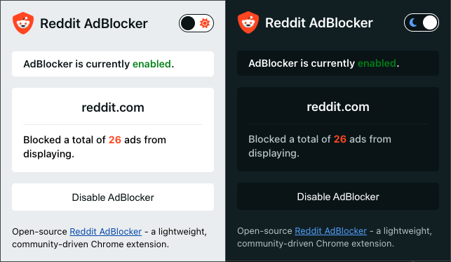

  
  <h1>Reddit AdBlocker</h1>
  
Reddit AdBlocker is a lightweight Chrome extension designed to enhance your Reddit experience by blocking ads. With customizable settings, support for various Reddit versions, and a sleek UI, enjoy a clutter-free browsing experience tailored to your preferences.

  

## Table of Contents

- [Features](#features)
- [Installation](#installation)
- [Usage](#usage)
- [Video Demo](#video-demo)
- [Contribution](#contribution)
- [License](#license)

## Features

| Feature                | Description                                                                                   |
| ---------------------- | --------------------------------------------------------------------------------------------- |
| **Ad Blocking**        | Effectively blocks ads on Reddit to provide an uninterrupted browsing experience.             |
| **Toggle Functionality**| Enable or disable ads on Reddit based on your preference.                                     |
| **Compatibility**      | Works seamlessly with all new Reddit versions, including sh.reddit.com and reddit.com.        |
| **Dark/Light Mode**     | Enjoy a clean and modern UI with support for Reddit's color scheme.                            |
| **Ads Blocked Counter** | Stay informed with a visible count of how many ads have been blocked.                           |
| **Open Source**         | Contribute to the project and make it even better. [GitHub Repository](https://github.com/musabdev/reddit-adblocker) |

## Installation

1. Download the latest release of Reddit AdBlocker from the [Releases Page](https://github.com/musabdev/reddit-adblocker/releases).
2. Extract the downloaded ZIP file.
3. Open Chrome and navigate to `chrome://extensions/`.
4. Enable 'Developer mode' in the top right corner.
5. Click on 'Load unpacked' and select the extracted folder.

## Usage

Once installed, Reddit AdBlocker runs seamlessly in the background. Access the extension settings by clicking on the extension icon in the toolbar. Customize your ad-blocking preferences, toggle dark or light mode, and enjoy a personalized Reddit experience.

## Video Demo

Watch the demo video to see Reddit AdBlocker in action:

## Contribution

We welcome contributions from the community. Fork the repository, make improvements, and submit a pull request. Together, we can create the best ad-blocking solution for Reddit.

## License

This project is licensed under the [MIT License](LICENSE).

---

**Made with ❤️ by [Musab](https://musabdev.com) and the developers.**

